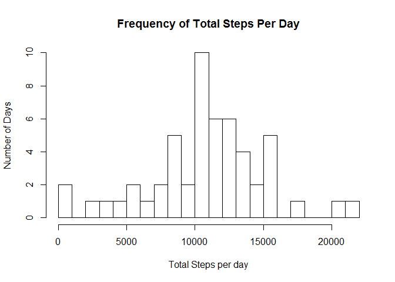
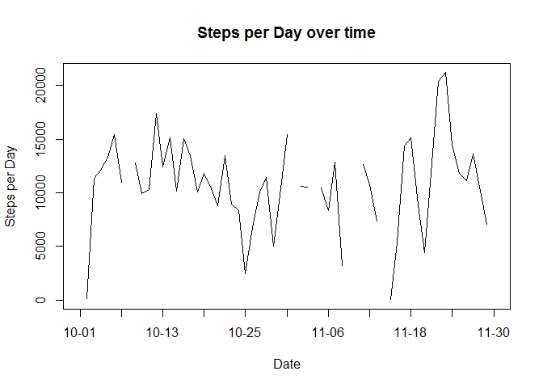
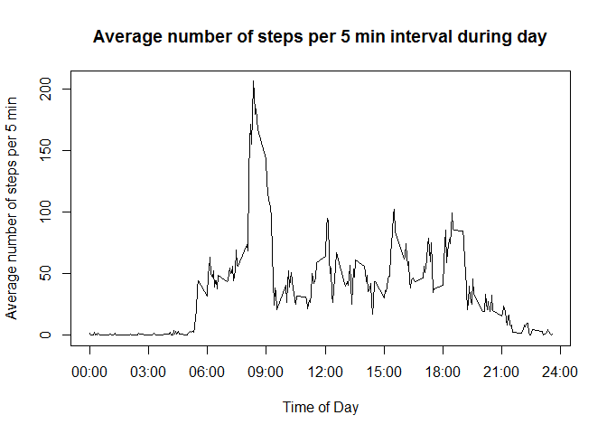
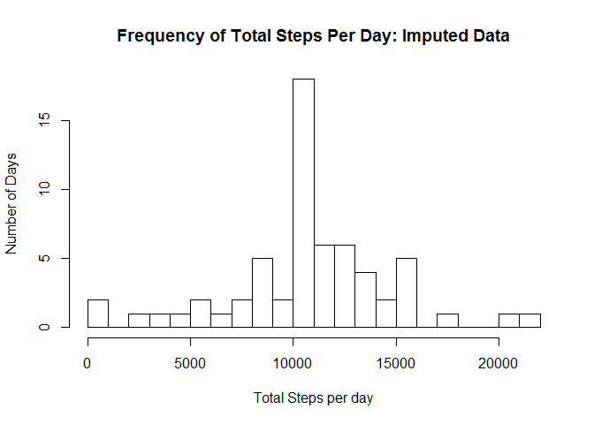
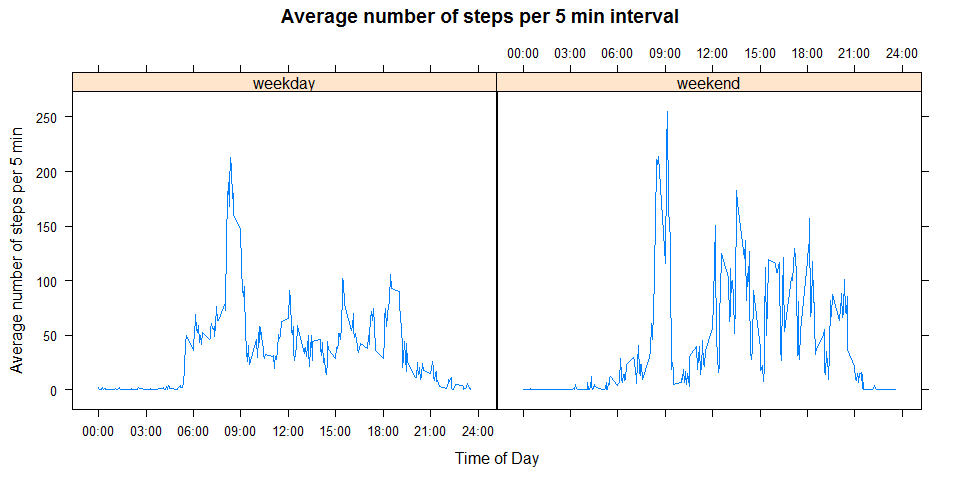

# Reproducible Research: Peer Assessment 1
Sherman Wood  
September 11, 2016  

## Summary

We will analyze data from a personal activity monitoring device to determine activity patterns over time.

## Loading and preprocessing the data

The device collects data at 5 minute intervals through out the day. The data consists of two months of data from an anonymous individual collected during the months of October and November, 2012 and include the number of steps taken in 5 minute intervals each day.

The variables included in this dataset are:

- steps: Number of steps taking in a 5-minute interval (missing values are coded as NA)
- date: The date on which the measurement was taken in YYYY-MM-DD format
- interval: Identifier for the 5-minute interval in which measurement was taken. integer as HHMM

The dataset is stored in a comma-separated-value (CSV) file and there are a total of 17,568 observations in this dataset.

We load the data, controlling the column types (classes). There are some "NA"s in the data, which we will leave for now.


```r
unzip("activity.zip")
activity <- read.csv("activity.csv", colClasses=c("integer","Date", "integer"), na.strings = c("NA"))
```

Let's have a look at the data.


```r
byDate <- summarize(group_by(activity, date), steps=sum(steps))
hist(byDate$steps, breaks = 30, main = "Frequency of Total Steps Per Day",
     xlab="Total Steps per day", ylab = "Number of Days")
```

<!-- -->

```r
dates <- group_by(byDate, date)

plot(byDate$date, byDate$steps, type = "l", main = "Steps per Day over time", 
     xlab = "Date", ylab = "Steps per Day", xaxt = "n")

axis.Date(1, at=dates[seq(1, nrow(dates), 6),]$date, format = "%m-%d")
```

<!-- -->

## What is mean total number of steps taken per day?

The mean number of steps per day by the person was  : 10766.2.

The median number of steps per day by the person was: 10765.

## What is the average daily activity pattern?


```r
byInterval <- summarize(group_by(activity, interval), meanSteps=mean(steps, na.rm = TRUE))

# integer as hhmm
displayTime <- function(mins) {
  paste(sprintf("%02d", floor(mins / 100)),
        sprintf("%02d", floor(mins %% 100)),
        sep=":"
  )
}

plot(byInterval$interval, byInterval$meanSteps, type = "l", main = "Average number of steps per 5 min interval during day", 
     xlab = "Time of Day", ylab = "Average number of steps per 5 min", xaxt = "n")
axis(1, at=seq(0, 2400, 300), labels=displayTime(seq(0, 2400, 300)) )
```

<!-- -->

The time of day when the person took the most steps on average was: 08:35.

## Imputing missing values

There are 2304 NAs in the original data, which is 13.11% of the base data set. 

For cleaner results, we will impute missing step values by replacing NAs with the mean number of steps in the corresponding 5 min interval of the row.


```r
imputedActivity <- sqldf("SELECT case 
                          when activity.steps is null 
                              then round(byInterval.meanSteps)
                          else
                            activity.steps
                          end as steps,
                          date,
                          interval
                          FROM activity
                          JOIN byInterval USING(interval)")
              
imputedByDate <- summarize(group_by(imputedActivity, date), steps=sum(steps))
              
hist(imputedByDate$steps, breaks = 30, main = "Frequency of Total Steps Per Day: Imputed Data",
     xlab="Total Steps per day", ylab = "Number of Days")
```

<!-- -->

After imputing the missing values:

- The mean number of steps per day by the person was  : 10765.64.
- The median number of steps per day by the person was: 10762.

## Are there differences in activity patterns between weekdays and weekends?

Let's compare the person's activity between weekdays and weekends.

```r
dayType <- function(x) {
    day <- weekdays(x, abbreviate = TRUE)
    sapply(day, function(d) 
      if (d == "Sat" || day == "Sun") {
        as.factor("weekend")
      } else {
        as.factor("weekday")
      }
    )
}

imputedActivity$dayType <- dayType(imputedActivity$date)

imputedByInterval <- summarize(group_by(imputedActivity, dayType, interval), meanSteps=mean(steps))
xyplot(meanSteps ~ interval | dayType, data = imputedByInterval, type = "l", main = "Average number of steps per 5 min interval", 
     xlab = "Time of Day", ylab = "Average number of steps per 5 min",
     scales = list(
          x=list(
            at=seq(0, 2400, 300), 
            labels=displayTime(seq(0, 2400, 300))
          )
     )
)
```

<!-- -->

This person is more active on the weekend.

